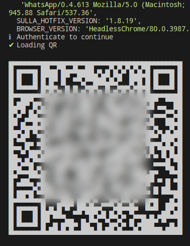

# Chatbot-wpp-si
<<<<<<< HEAD
<<<<<<< HEAD

Bot para WhatsApp Web usando sulla e keyv para gerenciamento de sessões.

---

## Instalar dependencias

`yarn install`

---

## Executar

`yarn start`

Em um celular com whatsapp, scaneia o código gerado no terminal.

=======
Chatbot para whatsapp
>>>>>>> 81598ab706b7eb4eb83e47b4ce3fcc5f839622e8
=======
Bot para whatsapp
>>>>>>> 05e01c79576b24d8ea5cea3bc79622c5ded456a8
